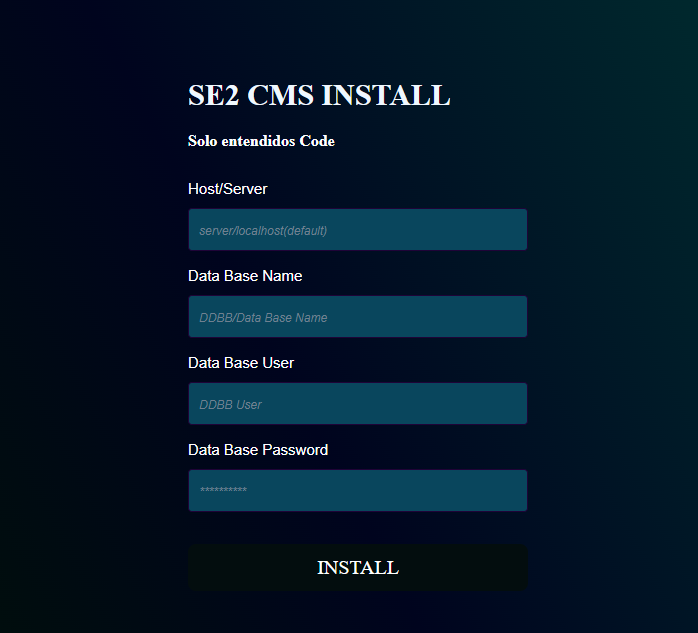

# CMS installation front end
This is a part of a CMS project, in this form that can be multipurpose, a prototype has been created for the interface that will make the connection with the database of an existing hosting through php and mysql, to create this simple but efficient form I used **HTML** and **CSS**, to achieve the gradient that shows in its background I used the online tool [cssgradient.io](https://cssgradient.io/ "css gradient tool") as a reference to obtain the final result.

## How to install
It really is a very simple code that only has a folder called "css" with its respective file and in the main directory we have the file "connPage.html"

### Structure
* **css**
    * style.css
* **connPage.html**

I didn't use any kind of framework in this project, it's made with pure **html** and **css**, so you don't need more than the files and test it in the browser.

## Use
The main purpose for me was to design a form for the installation of my future **[CMS](https://kinsta.com/knowledgebase/content-management-system/ "what's cms?")**, but you can download the code and modify it for **Login**, o **Registration** en algún **proyecto web**.

## Support

If you need info or help with this code, due to a problem in its use, or malfunction, you can contact me at **webmaster@todonline.co** As this code progresses, more support channels will be created.

## Project and future versions

As this is a complement to a large-scale project, new additions to this code will be being made and it will also be linked to other repositories that make up the main project. I will try to update each resource, framework or code complement constantly.

## Autores

This idea has been an initiative of **_SE2 Code_** contributors to projects such as:

* **[todonline.co](https://todonline.co "barbers page")**
* **[audiomasterfree.com](https://audiomasterfree.com "Free VST resource site")**

## **[License](https://choosealicense.com/licenses/mpl-2.0/ "license")**

### Mozilla Public License Version 2.0

For information about the license you can follow the link **[License](https://choosealicense.com/licenses/mpl-2.0/ "license")**

## Project status

Este proyecto esta en su etapa inicial de desarrollo, y este repositorio es parte de un **CMS** que trabajará con **PHP, JS, HTML y CSS**. 

